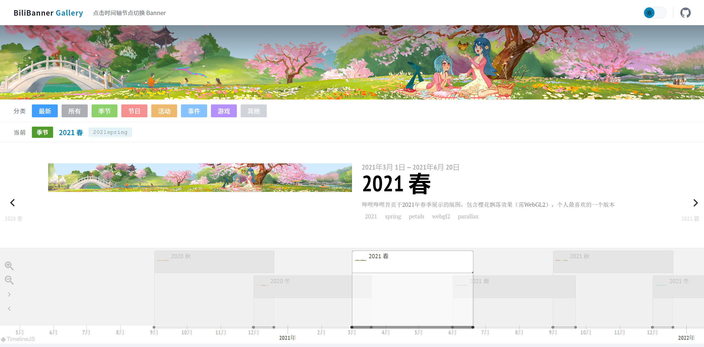

## BiliBanner 模块

**最近太累了喵，身体不舒服喵，暂停更新一段时间喵...**

**过段时间会回来更新的喵...**

**争取补全从 2010 年到现在的所有历史数据喵...**

---

Bilibili 动态视差、游戏 Banner 独立组件，基于 Vue2 + Webpack 构建

支持哔哩哔哩`2020秋~现在`的全部动态 Banner，包括 2022 年的游戏 Banner ~~（当然以前的静态 Banner 也是支持的，只需要正确配置...）~~



也可前往[此处](https://mikufan039.github.io/bilibanner.html)强势围观施（xia）工（ji）现（ba）场（gao）

---

## 快速开始

### 1. 安装依赖

在开始前请先执行以下指令安装依赖项

```bash
npm install
```

### 2. 预览页面

- 安装依赖后即可执行以下指令启动项目

```bash
npm run serve
```

- 启动完毕项目后即可打开以下网址预览

```
http://localhost:8080
```

### 3. 作为独立组件嵌入页面

本项目也可以作为一个独立的嵌入式组件使用

使用起来非常简单，只需要以下两个步骤

<details>
<summary>查看使用教程</summary>

#### 1. 构建项目

- 执行以下指令构建项目

```bash
npm run build
```

\* 如需指定静态服务器地址，请修改`src/main.js`中的`BASE_URL`

~~也可修改构建后的`bilibanner.js`（搜索 localhost 并替换）~~

- 构建完毕后`dist/res/js/bilibanner.js`即为独立的嵌入组件

如果只需要组件和资源文件，保留这些构建产物即可

```
dist/
  └─res/
      ├─bilibanner/
      └─js/
```

#### 2. 嵌入组件

使用方式非常简单，只需要如下三步：

```html
<!-- 1. 创建挂载点 -->
<div id="bili-banner"></div>

<!-- 2. 引入构建产物 -->
<script src="res/js/bilibanner.js"></script>

<!-- 3. 初始化Banner -->
<script>
  /* 共两种方式：bannerID 和 API URL
    （两种方式请二选一）
  */
  // 方法一：传入 bannerID → 自动拼接为 http://{host}/res/bilibanner/2021spring/manifest.json
  BiliBanner.init("2021spring");

  // 方法二：传入 API URL
  // BiliBanner.init('https://api.bilibili.com/x/web-show/page/header/v2?resource_id=142')
</script>
```

完整示例 HTML 文件请见`src/gallery/demo.html`

（可在构建后访问`http://localhost:8080/demo`预览）

</details>

---

## 系统要求

如果要启用 2022 版春、夏、秋的动态 banner，请确保你的设备和浏览器满足以下要求：

### 对设备的要求：

1. 内存 `>= 4GB`
2. 网络至少 `3G`

### 对浏览器的要求：

1. 不支持[`Safari`浏览器](src/components/animated-banner/index.vue#L33 "官方：因性能问题禁用")
2. 需支持[`WebGL2`](https://developer.mozilla.org/zh-CN/docs/Web/API/WebGL_API#webgl_2)
3. 需支持[`Shadow DOM`]("https://developer.mozilla.org/zh-CN/docs/Web/API/Web_components/Using_shadow_DOM" "影子 DOM")
4. CSS 需支持[`image-rendering: pixelated`](https://developer.mozilla.org/zh-CN/docs/Web/CSS/Reference/Properties/image-rendering#pixelated)
5. 需支持部分[`ES2020`语法]("https://developer.mozilla.org/zh-CN/docs/Web/JavaScript/Reference/Operators/Optional_chaining" "可选链运算符")

### 快速检测：

可将以下脚本粘贴到控制台执行

```javascript
const supportWebGL2=!!document.createElement("canvas").getContext("webgl2"),supportPixel="undefined"!=typeof CSS&&CSS.supports("image-rendering: pixelated"),supportShadow=!!document.createElement("div").attachShadow,supportMemory=!(navigator.deviceMemory&&navigator.deviceMemory<4),supportNetwork=!["slow-2g","2g"].includes(navigator.connection?.effectiveType),notSafari=!/^((?!chrome|android).)*safari/i.test(navigator.userAgent),supportOptionalChaining=(()=>{try{return eval("const obj = {}; obj?.prop;"),!0}catch(o){return!1}})();console.log("检测结果：",{supportWebGL2:supportWebGL2,supportPixel:supportPixel,supportShadow:supportShadow,supportMemory:supportMemory,supportNetwork:supportNetwork,notSafari:notSafari,supportOptionalChaining:supportOptionalChaining}),supportWebGL2&&supportPixel&&supportShadow&&supportMemory&&supportNetwork&&notSafari||console.warn("设备未达标"),console.log("检测通过");
```

---

## 其他说明

### 1.Banner 元数据传参：

`BiliBanner.init()` 接受两种参数

| 参数 | 类型   | 说明                                                                                                            |
| ---- | ------ | --------------------------------------------------------------------------------------------------------------- |
| ID   | string | 指定的 banner ID<br>例：当 ID 为`2021spring`时自动从`http://{host}/res/bilibanner/2021spring/manifest.json`加载 |
| Url  | String | banner JSON Url<br>例：`https://api.bilibili.com/x/web-show/page/header/v2?resource_id=142`                     |

\* 当输入的 Url 有误或 ID 有误（或未指定 ID、Url 参数），将自动加载 ID 为`error`的 banner。

### 2. Banner 元数据获取：

1. 下载最新 Banner

运行以下指令自动下载最新的 Banner 元数据和资源，并自动同步到 `latest`

（若未指定`banner_name`将使用默认名称）

```bash
npm run garb -- --name <banner_name>
```

2. 下载历史 Banner

可通过[Wayback Machine](http://web.archive.org/)查找页面快照获取

Banner JSON 结构如下，对于以前的静态 Banner 只需要保证有`pic`字段即可

```json
{
  "code": 0,
  "message": "0",
  "ttl": 1,
  "data": {
    "name": "",
    "pic": "",
    "litpic": "",
    "url": "",
    "is_split_layer": 0,
    "split_layer": "",
    "request_id": ""
  }
}
```

各字段说明（某些字段可能不展示，但不建议省略字段以及相关资源）

| 字段           | 类型    | 说明                                                                               | 必须 |
| -------------- | ------- | ---------------------------------------------------------------------------------- | ---- |
| name           | string  | Banner 名称                                                                        | N    |
| pic            | string  | Banner 主图                                                                        | Y    |
| litpic         | string  | 左侧"bilibili"Logo<br>（默认不展示，但不建议省略该字段及相关资源）                 | Y    |
| url            | string  | 活动链接                                                                           | N    |
| is_split_layer | boolean | 是否为视差 Banner<br>`0`：否 `1`：是                                               | Y    |
| split_layer    | text    | Banner 分层数据<br>为转义后的 JSON 对象，仅当`is_split_layer`为`1`时该字段存在内容 | Y    |
